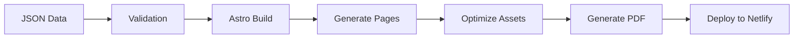

# 🚀 Astro Migration Plan for CV Website

## Executive Summary

Migrating the current single-file React-based CV website to Astro framework to achieve:
- **98% bundle size reduction** (3MB → ~40KB)
- **Build-time data injection** via JSON
- **SSR/SSG hybrid rendering** on Netlify
- **Comprehensive testing** with Playwright
- **Type safety** with TypeScript
- **Better performance** and SEO

---

## 📋 Table of Contents

1. [Project Architecture](#project-architecture)
2. [Data Structure Design](#data-structure-design)
3. [Build System Configuration](#build-system-configuration)
4. [Routing Strategy](#routing-strategy)
5. [Component Architecture](#component-architecture)
6. [Testing Strategy](#testing-strategy)
7. [Deployment Configuration](#deployment-configuration)
8. [Migration Timeline](#migration-timeline)
9. [Risk Assessment](#risk-assessment)
10. [Success Metrics](#success-metrics)

---

## 🏗️ Project Architecture

### Directory Structure
```
cv-website-astro/
├── src/
│   ├── components/           # Reusable components
│   │   ├── Background/       # Algorithmic background
│   │   │   ├── GeometricConstellation.astro
│   │   │   └── geometric-shapes.ts
│   │   ├── Navigation/       # Navigation components
│   │   │   ├── DesktopNav.astro
│   │   │   └── MobileNav.astro
│   │   ├── Sections/         # Page sections
│   │   │   ├── Hero.astro
│   │   │   ├── Skills.astro
│   │   │   ├── Experience.astro
│   │   │   └── Contact.astro
│   │   └── UI/               # UI components
│   │       ├── Card.astro
│   │       ├── Timeline.astro
│   │       └── SocialLinks.astro
│   ├── data/                 # JSON data sources
│   │   ├── personal.json     # Personal info
│   │   ├── experience.json   # Work experience
│   │   ├── skills.json       # Skills data
│   │   ├── projects.json     # Projects (future)
│   │   └── config.json       # Site configuration
│   ├── layouts/              # Page layouts
│   │   ├── BaseLayout.astro
│   │   └── CVLayout.astro
│   ├── pages/                # File-based routing
│   │   ├── index.astro       # Home page
│   │   ├── experience/       # Experience routes
│   │   │   └── [slug].astro  # Dynamic experience pages
│   │   ├── api/              # API routes
│   │   │   └── cv.json.ts    # JSON API endpoint
│   │   └── 404.astro         # Error page
│   ├── styles/               # Global styles
│   │   ├── global.css
│   │   ├── variables.css
│   │   └── utilities.css
│   ├── scripts/              # Client-side scripts
│   │   └── background.ts     # p5.js integration
│   ├── types/                # TypeScript definitions
│   │   └── cv.types.ts
│   └── utils/                # Utility functions
│       ├── data-loader.ts
│       └── formatters.ts
├── public/                   # Static assets
│   ├── fonts/
│   ├── images/
│   └── downloads/
│       └── cv.pdf
├── tests/                    # Test files
│   ├── unit/                 # Unit tests
│   │   ├── components/
│   │   └── utils/
│   ├── e2e/                  # E2E tests
│   │   ├── navigation.spec.ts
│   │   ├── responsive.spec.ts
│   │   └── accessibility.spec.ts
│   └── fixtures/             # Test data
│       └── mock-data.json
├── scripts/                  # Build scripts
│   ├── generate-cv-pdf.js   # PDF generation
│   ├── validate-data.js     # Data validation
│   └── optimize-images.js   # Image optimization
├── astro.config.mjs          # Astro configuration
├── netlify.toml              # Netlify configuration
├── playwright.config.ts      # Playwright configuration
├── package.json
├── tsconfig.json             # TypeScript configuration
└── README.md
```

---

## 📊 Data Structure Design

### Core Data Schema

#### `/src/data/personal.json`
```json
{
  "version": "1.0.0",
  "lastUpdated": "2024-01-01",
  "personal": {
    "firstName": "Farshid",
    "lastName": "Pourlatifi",
    "title": "Front-End Developer",
    "email": "farshid.pourlatifi@gmail.com",
    "phone": "+90 555 555 5555",
    "location": {
      "city": "Istanbul",
      "country": "Turkey",
      "timezone": "Europe/Istanbul"
    },
    "bio": "Front-End Developer with 20+ years experience...",
    "social": {
      "linkedin": "https://linkedin.com/in/farshidpourlatifi",
      "github": "https://github.com/farshid",
      "twitter": "@farshid",
      "portfolio": "https://farshid-pourlatifi.netlify.app"
    },
    "languages": [
      { "name": "English", "level": "Professional" },
      { "name": "Turkish", "level": "Fluent" },
      { "name": "Persian", "level": "Native" }
    ]
  }
}
```

#### `/src/data/experience.json`
```json
{
  "version": "1.0.0",
  "experiences": [
    {
      "id": "younea-2024",
      "company": "Younea",
      "logo": "/images/companies/younea.svg",
      "location": "Geneva, Switzerland",
      "type": "remote",
      "role": "Senior Full Stack Developer",
      "level": "Senior",
      "startDate": "2024-01-01",
      "endDate": null,
      "current": true,
      "description": "Leading development of AI-driven platform...",
      "achievements": [
        {
          "id": "ach-1",
          "description": "Implemented Redis caching...",
          "impact": "40% improvement in API response time",
          "technologies": ["Redis", "Node.js"]
        }
      ],
      "technologies": [
        "JavaScript", "TypeScript", "React", "Node.js",
        "Python", "Django", "PostgreSQL", "Redis"
      ],
      "highlights": ["team-lead", "architecture", "ai-integration"]
    }
  ]
}
```

#### `/src/data/skills.json`
```json
{
  "version": "1.0.0",
  "categories": [
    {
      "id": "frontend",
      "name": "Front-End",
      "icon": "🎨",
      "skills": [
        {
          "name": "JavaScript",
          "level": "expert",
          "years": 15,
          "keywords": ["ES6+", "Async", "DOM"]
        },
        {
          "name": "React",
          "level": "expert",
          "years": 8,
          "keywords": ["Hooks", "Context", "Redux"]
        }
      ]
    },
    {
      "id": "backend",
      "name": "Back-End",
      "icon": "⚙️",
      "skills": [
        {
          "name": "Node.js",
          "level": "advanced",
          "years": 10,
          "keywords": ["Express", "Fastify", "NestJS"]
        }
      ]
    }
  ]
}
```

#### `/src/data/config.json`
```json
{
  "site": {
    "title": "Farshid Pourlatifi - CV",
    "description": "Senior Full Stack Developer with 20+ years experience",
    "url": "https://farshid-pourlatifi.netlify.app",
    "image": "/og-image.png"
  },
  "theme": {
    "colors": {
      "primary": "#0A3A52",
      "accent": "#F0000F",
      "background": "#FFFFFF"
    },
    "fonts": {
      "heading": "Inter",
      "body": "Inter"
    }
  },
  "features": {
    "enableBlog": false,
    "enableProjects": true,
    "enableTestimonials": false,
    "enableAnalytics": true,
    "enablePdfDownload": true
  },
  "build": {
    "generatePdf": true,
    "optimizeImages": true,
    "enablePwa": false
  }
}
```

### Data Validation Schema (using Zod)

```typescript
// /src/types/cv.types.ts
import { z } from 'zod';

export const PersonalSchema = z.object({
  firstName: z.string().min(1),
  lastName: z.string().min(1),
  title: z.string().min(1),
  email: z.string().email(),
  // ... complete schema
});

export const ExperienceSchema = z.object({
  id: z.string(),
  company: z.string(),
  role: z.string(),
  startDate: z.string().datetime(),
  endDate: z.string().datetime().nullable(),
  // ... complete schema
});

export type Personal = z.infer<typeof PersonalSchema>;
export type Experience = z.infer<typeof ExperienceSchema>;
```

---

## 🔧 Build System Configuration

### Astro Configuration

```javascript
// astro.config.mjs
import { defineConfig } from 'astro/config';
import netlify from '@astrojs/netlify';
import react from '@astrojs/react';
import compress from 'astro-compress';
import sitemap from '@astrojs/sitemap';

export default defineConfig({
  site: 'https://farshid-pourlatifi.netlify.app',
  output: 'hybrid', // SSR + SSG
  adapter: netlify(),
  integrations: [
    react({ include: ['**/Background.tsx'] }), // Only for p5.js component
    sitemap(),
    compress({
      CSS: true,
      HTML: true,
      JavaScript: true,
      Image: false, // Handle separately
    }),
  ],
  vite: {
    build: {
      rollupOptions: {
        output: {
          manualChunks: {
            'p5': ['p5'],
          },
        },
      },
    },
  },
});
```

### Build Pipeline



### Build Scripts

```json
// package.json scripts
{
  "scripts": {
    "dev": "astro dev",
    "build": "npm run validate && npm run build:astro && npm run postbuild",
    "build:astro": "astro build",
    "validate": "node scripts/validate-data.js",
    "postbuild": "npm run generate:pdf && npm run optimize:images",
    "generate:pdf": "node scripts/generate-cv-pdf.js",
    "optimize:images": "node scripts/optimize-images.js",
    "preview": "astro preview",
    "test": "npm run test:unit && npm run test:e2e",
    "test:unit": "vitest",
    "test:e2e": "playwright test",
    "test:e2e:ui": "playwright test --ui",
    "lint": "eslint . --ext .ts,.tsx,.astro",
    "format": "prettier --write ."
  }
}
```

---

## 🗺️ Routing Strategy

### Route Structure

```
/                           # Home (SSG)
/experience/               # Experience listing (SSG)
/experience/[slug]         # Individual experience (SSG)
/api/cv.json              # JSON API (SSR)
/api/cv.pdf               # PDF download (SSR)
/404                      # Error page (SSG)
```

### Page Rendering Modes

| Route | Mode | Reason |
|-------|------|--------|
| `/` | SSG | Static content, best performance |
| `/experience/*` | SSG | Build from JSON data |
| `/api/*` | SSR | Dynamic data access |

### Dynamic Route Example

```astro
---
// /src/pages/experience/[slug].astro
export async function getStaticPaths() {
  const experiences = await import('../../data/experience.json');
  return experiences.experiences.map(exp => ({
    params: { slug: exp.id },
    props: { experience: exp }
  }));
}

export const prerender = true; // SSG this route
---
```

---

## 🧩 Component Architecture

### Component Hierarchy

```
BaseLayout
├── CVLayout
│   ├── Navigation
│   │   ├── DesktopNav
│   │   └── MobileNav
│   ├── GeometricBackground (React Island)
│   ├── Main
│   │   ├── Hero
│   │   ├── Skills
│   │   │   └── SkillCard
│   │   ├── Experience
│   │   │   └── ExperienceCard
│   │   └── Contact
│   └── Footer
│       └── SocialLinks
```

### Island Architecture Strategy

| Component | Type | Hydration |
|-----------|------|-----------|
| GeometricBackground | React | `client:idle` |
| Navigation | Astro | Static |
| ExperienceCarousel | React | `client:visible` |
| SkillFilter | React | `client:load` |
| Everything else | Astro | Static |

---

## 🧪 Testing Strategy

### Testing Stack

- **Unit Tests**: Vitest
- **Component Tests**: Astro + Testing Library
- **E2E Tests**: Playwright
- **Visual Regression**: Percy (optional)
- **Accessibility**: axe-core

### Test Coverage Goals

| Type | Coverage | Priority |
|------|----------|----------|
| Unit | 80% | High |
| Component | 70% | Medium |
| E2E | Critical paths | High |
| Accessibility | WCAG AA | High |

### Unit Test Example

```typescript
// /tests/unit/utils/formatters.test.ts
import { describe, it, expect } from 'vitest';
import { formatDate, calculateDuration } from '../../src/utils/formatters';

describe('formatters', () => {
  describe('formatDate', () => {
    it('should format date correctly', () => {
      expect(formatDate('2024-01-01')).toBe('Jan 2024');
    });
  });

  describe('calculateDuration', () => {
    it('should calculate work duration', () => {
      expect(calculateDuration('2023-01-01', '2024-01-01')).toBe('1 year');
    });
  });
});
```

### E2E Test Example

```typescript
// /tests/e2e/navigation.spec.ts
import { test, expect } from '@playwright/test';

test.describe('Navigation', () => {
  test('should navigate between sections on desktop', async ({ page }) => {
    await page.goto('/');

    // Check initial state
    await expect(page.locator('[data-section="home"]')).toBeVisible();

    // Navigate to skills
    await page.click('[data-nav="skills"]');
    await expect(page.locator('[data-section="skills"]')).toBeVisible();

    // Navigate to experience
    await page.click('[data-nav="experience"]');
    await expect(page.locator('[data-section="experience"]')).toBeVisible();
  });

  test('should be accessible on mobile', async ({ page }) => {
    await page.setViewportSize({ width: 375, height: 667 });
    await page.goto('/');

    // Check mobile menu
    await page.click('[data-mobile-menu-toggle]');
    await expect(page.locator('[data-mobile-menu]')).toBeVisible();
  });
});
```

### Accessibility Test Example

```typescript
// /tests/e2e/accessibility.spec.ts
import { test, expect } from '@playwright/test';
import { injectAxe, checkA11y } from 'axe-playwright';

test.describe('Accessibility', () => {
  test('should pass WCAG AA standards', async ({ page }) => {
    await page.goto('/');
    await injectAxe(page);
    await checkA11y(page, null, {
      detailedReport: true,
      detailedReportOptions: {
        html: true
      }
    });
  });
});
```

### Visual Regression Test

```typescript
// /tests/e2e/visual.spec.ts
test('should match visual snapshot', async ({ page }) => {
  await page.goto('/');
  await expect(page).toHaveScreenshot('homepage.png', {
    fullPage: true,
    animations: 'disabled'
  });
});
```

---

## 🚀 Deployment Configuration

### Netlify Configuration

```toml
# netlify.toml
[build]
  command = "npm run build"
  publish = "dist"

[build.environment]
  NODE_VERSION = "20"

[[redirects]]
  from = "/api/*"
  to = "/.netlify/functions/:splat"
  status = 200

[[headers]]
  for = "/*"
  [headers.values]
    X-Frame-Options = "DENY"
    X-XSS-Protection = "1; mode=block"
    X-Content-Type-Options = "nosniff"
    Referrer-Policy = "strict-origin-when-cross-origin"
    Content-Security-Policy = "default-src 'self'; script-src 'self' 'unsafe-inline' https://cdnjs.cloudflare.com; style-src 'self' 'unsafe-inline';"

[[headers]]
  for = "/*.js"
  [headers.values]
    Cache-Control = "public, max-age=31536000, immutable"

[[headers]]
  for = "/*.css"
  [headers.values]
    Cache-Control = "public, max-age=31536000, immutable"

[dev]
  command = "npm run dev"
  targetPort = 4321
  port = 8888
  autoLaunch = true
```

### GitHub Actions CI/CD

```yaml
# .github/workflows/deploy.yml
name: Deploy to Netlify

on:
  push:
    branches: [main]
  pull_request:
    branches: [main]

jobs:
  test:
    runs-on: ubuntu-latest
    steps:
      - uses: actions/checkout@v3
      - uses: actions/setup-node@v3
        with:
          node-version: '20'
          cache: 'npm'

      - run: npm ci
      - run: npm run validate
      - run: npm run lint
      - run: npm run test:unit

      - name: Install Playwright
        run: npx playwright install --with-deps

      - run: npm run build
      - run: npm run test:e2e

      - name: Upload test results
        if: always()
        uses: actions/upload-artifact@v3
        with:
          name: test-results
          path: test-results/

  deploy:
    needs: test
    if: github.ref == 'refs/heads/main'
    runs-on: ubuntu-latest
    steps:
      - uses: actions/checkout@v3
      - uses: actions/setup-node@v3
        with:
          node-version: '20'

      - run: npm ci
      - run: npm run build

      - name: Deploy to Netlify
        uses: netlify/actions/deploy@v1
        with:
          github-token: ${{ secrets.GITHUB_TOKEN }}
          netlify-token: ${{ secrets.NETLIFY_AUTH_TOKEN }}
          netlify-site-id: ${{ secrets.NETLIFY_SITE_ID }}
          build-dir: './dist'
```

---

## 📅 Migration Timeline

### Phase 1: Setup & Foundation (Week 1)
- [ ] Initialize Astro project
- [ ] Set up TypeScript configuration
- [ ] Configure Netlify adapter
- [ ] Set up testing framework
- [ ] Create basic project structure

### Phase 2: Data Migration (Week 1)
- [ ] Convert CV data to JSON format
- [ ] Create data validation schemas
- [ ] Build data loader utilities
- [ ] Test data integrity

### Phase 3: Component Development (Week 2)
- [ ] Create layout components
- [ ] Migrate navigation components
- [ ] Build section components
- [ ] Integrate p5.js background

### Phase 4: Styling & Responsive (Week 2)
- [ ] Migrate CSS to modern system
- [ ] Implement responsive design
- [ ] Add animations/transitions
- [ ] Ensure accessibility

### Phase 5: Testing & Optimization (Week 3)
- [ ] Write unit tests
- [ ] Write E2E tests
- [ ] Performance optimization
- [ ] SEO optimization

### Phase 6: Deployment & Launch (Week 3)
- [ ] Configure CI/CD pipeline
- [ ] Set up monitoring
- [ ] Perform security audit
- [ ] Deploy to production
- [ ] DNS migration

---

## ⚠️ Risk Assessment

### Technical Risks

| Risk | Impact | Probability | Mitigation |
|------|--------|-------------|------------|
| p5.js integration issues | High | Medium | Use React island, test early |
| Bundle size regression | Medium | Low | Monitor with bundlephobia |
| SSR complications | Medium | Low | Use hybrid rendering |
| Data validation errors | Low | Medium | Comprehensive schema validation |

### Migration Risks

| Risk | Impact | Probability | Mitigation |
|------|--------|-------------|------------|
| Downtime during migration | High | Low | Use preview URLs first |
| SEO impact | High | Low | Maintain URL structure |
| Missing features | Medium | Low | Feature parity checklist |

---

## 📈 Success Metrics

### Performance Metrics

| Metric | Current | Target | Tool |
|--------|---------|--------|------|
| Bundle Size | 3MB | <50KB | Bundlephobia |
| Lighthouse Score | 60 | 95+ | Lighthouse |
| FCP | 3s | <1s | WebPageTest |
| TTI | 5s | <2s | WebPageTest |
| CLS | 0.5 | <0.1 | Core Web Vitals |

### Quality Metrics

| Metric | Target | Tool |
|--------|--------|------|
| Test Coverage | 80% | Vitest |
| Accessibility | WCAG AA | axe-core |
| SEO Score | 100 | Lighthouse |
| Type Coverage | 100% | TypeScript |

---

## 🔄 Rollback Plan

If issues arise:

1. **Immediate**: Revert Netlify deployment to previous version
2. **DNS**: Keep old site URL active during transition
3. **Data**: All JSON data versioned in Git
4. **Code**: Git tags for each deployment

---

## 📚 Required Dependencies

```json
{
  "dependencies": {
    "@astrojs/netlify": "^5.0.0",
    "@astrojs/react": "^3.0.0",
    "@astrojs/sitemap": "^3.0.0",
    "astro": "^4.0.0",
    "p5": "^1.7.0",
    "react": "^18.0.0",
    "react-dom": "^18.0.0"
  },
  "devDependencies": {
    "@astrojs/check": "^0.3.0",
    "@playwright/test": "^1.40.0",
    "@types/p5": "^1.7.0",
    "astro-compress": "^2.0.0",
    "axe-playwright": "^1.2.0",
    "eslint": "^8.0.0",
    "eslint-plugin-astro": "^0.29.0",
    "prettier": "^3.0.0",
    "prettier-plugin-astro": "^0.12.0",
    "typescript": "^5.0.0",
    "vitest": "^1.0.0",
    "zod": "^3.22.0"
  }
}
```

---

## 🎯 Next Steps

1. **Review & Approve** this plan
2. **Set up repository** with proper branching
3. **Initialize Astro project** with basic structure
4. **Begin Phase 1** implementation
5. **Weekly progress reviews**

---

## 📝 Notes

- All existing content will be preserved
- URLs will remain the same for SEO
- Progressive migration allows testing at each phase
- Rollback possible at any point
- Performance monitoring throughout

---

**Document Version**: 1.0.0
**Last Updated**: 2024-01-25
**Status**: PENDING APPROVAL